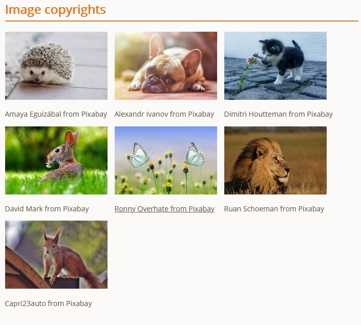
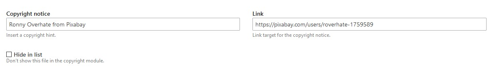

# Contao Image Copyright Bundle :framed_picture:

With this Contao bundle you can easily add a copyright notice to all images and then display them in a module or content element.

## Frontend


 
 *This is how it can look on the website.*

## Backend

You can add the copyright notice directly to the image in the file manager.


 
 *The backend view in files manager.*

## Install

### via Composer
```
composer require tastaturberuf/contao-image-copyright-bundle
```
### via Contao Manager
search for `tastaturberuf/contao-image-copyright-bundle`


## Translations

- [ ] Chinese - 中文(简体)
- [ ] Czech - Čeština
- [ ] Dutch - Nederlands
- [x] English - English
- [x] French - Français
- [x] German - Deutsch
- [ ] Italian - Italiano
- [ ] Japanese - 日本語
- [ ] Latvian - Latviešu
- [ ] Persian - فارسی
- [ ] Polish - Polski
- [ ] Portuguese - Português
- [ ] Russian - Русский
- [ ] Serbian - Српски
- [ ] Spanish - Español

## Maintainer
[Tastaturberuf](https://tastaturberuf.de) **with ♥ and Contao**
