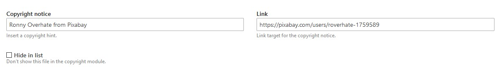
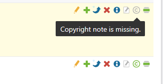

# Contao Image Copyright Bundle :framed_picture:

> [!NOTE]
> **Contao** is an Open Source PHP Content Management System for people who want a professional website that is easy to
> maintain. Visit the [project website](https://contao.org) for more information.

With this Contao bundle you can easily add a copyright notice to all images and then display them in a module.

Especially helpful if you use stock photos from various vendors and need to display the license notices.

## Frontend


*This is how it can look on the website.*

## Backend

You can add the copyright notice directly to the image in the file manager.


*The backend view in files manager.*



*Icon for the copyright status*

## Compatibility

- [ ] Contao 4.13 (install version `1.4.*`))
- [x] Contao 5.3
- [x] Contao 5.7

## Install

### via Composer

```
composer require tastaturberuf/contao-image-copyright-bundle
```

### via Contao Manager

search for `tastaturberuf/contao-image-copyright-bundle`

➡ [Link to the Contao Extension Repository](https://extensions.contao.org/?p=tastaturberuf%2Fcontao-image-copyright-bundle)

## Translations

- [x] English - English
- [x] French - Français
- [x] German - Deutsch
- [x] Spanish - Español

## Maintainer

[](https://github.com/tastaturberuf)

[](https://tastaturberuf.de)

**PHP with ♥ and Contao**